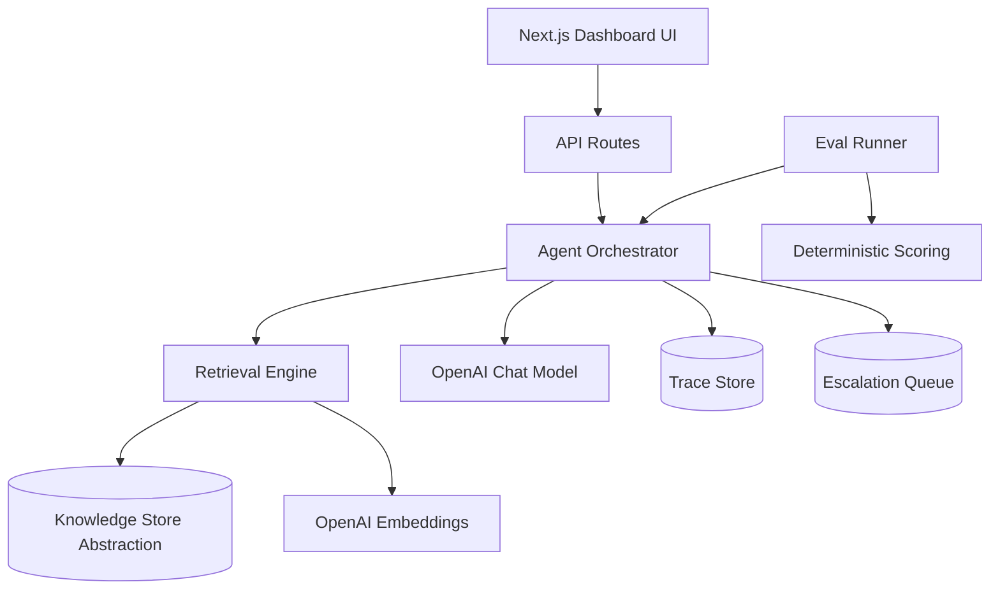

# SupportOps AI

Production-style AI support agent portfolio project with source-grounded RAG answers, deterministic evals, observability traces, and human-in-the-loop escalation.

## Project Overview
SupportOps AI is a full-stack support assistant that answers only from retrieved policy context, cites sources, and escalates uncertain cases. It demonstrates practical AI engineering patterns used in real production systems.

## Why This Matters
- Most LLM demos skip reliability and observability. This project includes both.
- Support teams need grounded answers, not hallucinated policy claims.
- Portfolio reviewers can inspect retrieval quality, latency, cost, and eval outcomes in one dashboard.

## Feature List
- Landing demo with live support Q&A
- Source-grounded answer generation with citations
- Dual retrieval mode:
  - Embedding search when `OPENAI_API_KEY` is present
  - Keyword fallback when API key is missing
- Escalation engine for low-confidence, missing context, conflict, legal/financial guarantee requests
- Trace panel with rewritten query, retrieved chunks, model, token usage, latency, and estimated cost
- Evaluation Studio with deterministic golden-case scoring
- Escalation queue with resolve flow and “add missing KB article” workflow
- Seeded realistic SaaS support documentation

## Tech Stack
- Next.js (App Router)
- TypeScript
- Tailwind CSS
- OpenAI API (`gpt-4.1-mini`, `text-embedding-3-small` by default)
- Postgres + pgvector (with JSON fallback for local/demo mode)
- Vitest for unit tests

## Architecture


## AI Pipeline
1. Accept support question
2. Rewrite query for retrieval
3. Retrieve top chunks (embedding or keyword mode)
4. Detect conflict + legal/financial risk + context sufficiency
5. Generate grounded answer from retrieved context
6. Attach citations and confidence
7. Decide escalation deterministically
8. Persist trace + optionally queue escalation

## Evaluation Methodology
Deterministic checks are primary (not LLM-as-judge only):
- Retrieval hit/miss
- Required facts presence heuristic
- Citation presence
- Escalation correctness
- Groundedness heuristic from answer-to-citation overlap
- Latency tracking per case

Included cases cover:
- Refund policy
- Annual cancellation
- Enterprise SSO
- Account deletion
- API rate limits
- Missing info escalation
- Conflicting-doc escalation
- Legal/financial guarantee escalation

## Repository Structure
- app/: Next.js routes/pages and API handlers
- components/: reusable dashboard and workflow components
- lib/ai/: prompts, model calls, escalation/cost logic
- lib/rag/: chunking + retrieval + conflict detection
- lib/evals/: golden dataset + scoring + runner
- lib/store/: persistence abstraction + Postgres/JSON adapters
- lib/seed/: seed dataset and seed helpers
- types/: shared TypeScript domain contracts
- scripts/: seed/eval/db setup CLI scripts
- db/migrations/: Postgres + pgvector schema
- data/: local JSON persistence (fallback backend)

## Local Setup
1. Install dependencies:
```bash
npm install
```
2. Configure environment:
```bash
cp .env.example .env.local
```
3. Optional: set `OPENAI_API_KEY` in `.env.local` for LLM + embedding mode.
4. For live persistence with Postgres, set `DATABASE_URL` and run:
```bash
npm run db:setup
```

## Run Commands
```bash
npm run db:setup   # create Postgres + pgvector tables
npm run seed       # seed support docs/chunks
npm run dev        # start app on localhost:3000
npm run evals      # run eval suite from CLI
npm test           # unit tests
npm run lint       # lint
npm run build      # production build check
```

## Pages
- `/` Landing + live demo with metrics and trace output
- `/knowledge-base` add/list support docs
- `/support-agent` agent workbench + trace panel
- `/evaluation-studio` deterministic eval runner + summary metrics
- `/escalation-queue` unresolved escalations + resolution workflows
- `/api/health` runtime health check (`ok`, backend, timestamp)

## Environment Variables
- `OPENAI_API_KEY` (optional but recommended)
- `OPENAI_CHAT_MODEL` (optional, default `gpt-4.1-mini`)
- `OPENAI_EMBEDDING_MODEL` (optional, default `text-embedding-3-small`)
- `STORE_BACKEND` (`json` or `postgres`, default auto-detect)
- `DATABASE_URL` (required for `postgres` backend)
- `PGVECTOR_EMBEDDING_DIM` (optional, default `1536`)
- `POSTGRES_SSL` (optional, `true` for hosted SSL-only Postgres)

## Screenshots (Placeholders)
- `docs/screenshots/landing-demo.png`
- `docs/screenshots/support-agent-trace.png`
- `docs/screenshots/eval-studio.png`
- `docs/screenshots/escalation-queue.png`

## 60-Second Demo Script
1. Open landing page and ask a refund/cancellation question.
2. Point to cited sources, confidence, latency, and cost.
3. Ask a legal guarantee question to trigger escalation.
4. Open Evaluation Studio and run evals.
5. Show pass rate and escalation accuracy metrics.
6. Open Escalation Queue and create a KB article from a queued case.

## Deployment Notes
- Works on Vercel/Node hosts with either backend:
  - `json`: easiest demo mode (ephemeral on many hosts)
  - `postgres`: persistent live mode (recommended for portfolio link)
- For Postgres mode: set `DATABASE_URL`, `STORE_BACKEND=postgres`, then run `npm run db:setup` once.
- Keep `OPENAI_API_KEY` in platform-managed secrets.

### Vercel Git Pipeline
1. Push repository to GitHub.
2. Import repository in Vercel and set production branch to `main`.
3. Add Production/Preview env vars in Vercel project settings:
   - `STORE_BACKEND=postgres`
   - `DATABASE_URL=...`
   - `OPENAI_API_KEY=...`
   - `OPENAI_CHAT_MODEL=...`
   - `OPENAI_EMBEDDING_MODEL=...`
   - `PGVECTOR_EMBEDDING_DIM=1536`
   - `POSTGRES_SSL=true` (if required by provider)
4. Run once after env configuration:
   - `npm run db:setup`
   - `npm run seed`
5. Branch workflow:
   - Push `feature/*` branches for Preview Deployments.
   - Merge to `main` for Production Deployment.

### GitHub Actions Fallback Pipeline
If direct Vercel Git integration is unavailable, use `.github/workflows/vercel-deploy.yml`.

Required GitHub repository secrets:
- `VERCEL_TOKEN` (classic personal token from Vercel Account Settings)
- `VERCEL_ORG_ID` (from `.vercel/project.json`)
- `VERCEL_PROJECT_ID` (from `.vercel/project.json`)

Behavior:
- Pull requests create preview deployments.
- Pushes to `main` deploy production.

### Live Ops / Hotfix Flow
1. Validate deployment:
   - `GET /api/health` returns `ok: true` and `backend: "postgres"`.
   - Verify `/support-agent`, `/evaluation-studio`, and `/escalation-queue`.
2. For production issues:
   - Create `hotfix/*` branch.
   - Validate in Vercel preview URL.
   - Merge into `main`.
3. If regression occurs:
   - Roll back from Vercel Deployments.

## Future Improvements
- Hybrid retrieval in-database (pgvector + keyword ranking)
- Auth + role-based access for support teams
- Structured observability export (OpenTelemetry + tracing backend)
- Queue integrations (Zendesk/Intercom/Jira)
- Offline eval dashboards and trend regression alerts

## Resume Bullet
Built SupportOps AI, a full-stack RAG support agent (Next.js + TypeScript) with source-grounded answers, deterministic eval suite, escalation queue, and trace-level observability for latency, token usage, and cost.
